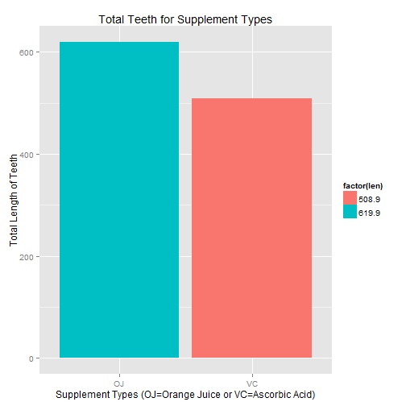

#-------------------------------------------------------------------------------
### Author : Arun Kumar Madas
### Date   : 04/24/2015
### Course : Statistical Inference - Project (Part 2 - ToothGrowth data analysis)
#-------------------------------------------------------------------------------

## Title : Analysis of ToothGrowth data available in R datasets 

### Overview :
In this project we're going to analyze the ToothGrowth data in the R datasets package. 

# 1. Load the ToothGrowth data and perform some basic exploratory data analyses 


```r
# load the datasets package available in R
library(datasets)
#check the data available in the ToothGrowth
head(ToothGrowth)
```

```
##    len supp dose
## 1  4.2   VC  0.5
## 2 11.5   VC  0.5
## 3  7.3   VC  0.5
## 4  5.8   VC  0.5
## 5  6.4   VC  0.5
## 6 10.0   VC  0.5
```

Here we are analyzing The Effect of Vitamin C on Tooth Growth in Guinea Pigs.
If you need to read more details about the ToothGrowth data it is available here https://stat.ethz.ch/R-manual/R-devel/library/datasets/html/ToothGrowth.html

The response is the length of odontoblasts (teeth) in each of 10 guinea pigs at each of three dose levels of Vitamin C (0.5, 1, and 2 mg) with each of two delivery methods (orange juice or ascorbic acid).

The data frame ToothGrowth contains three columns

[,1]    len	numeric	Tooth length
[,2]	supp	factor	Supplement type (VC or OJ).
[,3]	dose	numeric	Dose in milligrams.

Lets perform some sample exploratory data analysis:

1. Calculate the total tooth per each of the supplement types (OJ=Orange Juice or VC=Ascorbic Acid).


```r
 total_tooth_per_supplement_type <- aggregate(len~supp,ToothGrowth,sum,na.action=na.omit)
 total_tooth_per_supplement_type
```

```
##   supp   len
## 1   OJ 619.9
## 2   VC 508.9
```

Plot for total tooth per each of the supplement types (OJ=Orange Juice or VC=Ascorbic Acid) and their counts.


```r
library(ggplot2)
 ggplot(data = total_tooth_per_supplement_type, aes(x=supp,y=len, fill=factor(len))) +
 geom_bar(stat = "identity") +
 xlab("Supplement Types (OJ=Orange Juice or VC=Ascorbic Acid)") + ylab("Total Length of Teeth") + ggtitle("Total Teeth for Supplement Types")
```

 

2. Calculate the total tooth per each of the Vitamin C levels (0.5, 1, and 2 mg)


```r
 total_tooth_per_dose_type <- aggregate(len~dose,ToothGrowth,sum,na.action=na.omit)
 total_tooth_per_dose_type
```

```
##   dose   len
## 1  0.5 212.1
## 2  1.0 394.7
## 3  2.0 522.0
```

Plot for total tooth per each of the Vitamin C levels (0.5, 1, and 2 mg) 


```r
library(ggplot2)
 total_tooth_per_dose_type[,1]<-as.character(total_tooth_per_dose_type[,1])
 ggplot(data = total_tooth_per_dose_type, aes(x=(dose),y=len, fill=factor(len))) +
 geom_bar(stat = "identity") +
 xlab("Vitamin C levels (0.5, 1, and 2 mg)") + ylab("Total Length of Teeth") + ggtitle("Total Teeth for Vitamin C Levels")
```

 

# 2. Provide a basic summary of the data.

calculate mean and standard deviation of length data


```r
summary(ToothGrowth)
```

```
##       len        supp         dose      
##  Min.   : 4.20   OJ:30   Min.   :0.500  
##  1st Qu.:13.07   VC:30   1st Qu.:0.500  
##  Median :19.25           Median :1.000  
##  Mean   :18.81           Mean   :1.167  
##  3rd Qu.:25.27           3rd Qu.:2.000  
##  Max.   :33.90           Max.   :2.000
```

```r
mean(ToothGrowth$len)
```

```
## [1] 18.81333
```

```r
sd(ToothGrowth$len)
```

```
## [1] 7.649315
```

Lets calculate the mean, sd of the supp vs dose


```r
 mean_tooth_per_supplement_type <- aggregate(len~supp,ToothGrowth,mean,na.action=na.omit)
 mean_tooth_per_supplement_type
```

```
##   supp      len
## 1   OJ 20.66333
## 2   VC 16.96333
```

```r
 mean_tooth_per_dose_type <- aggregate(len~dose,ToothGrowth,mean,na.action=na.omit)
 mean_tooth_per_dose_type
```

```
##   dose    len
## 1  0.5 10.605
## 2  1.0 19.735
## 3  2.0 26.100
```

# 3. Use confidence intervals and/or hypothesis tests to compare tooth growth by supp and dose. (Only use the techniques from class, even if there's other approaches worth considering)

The tooth growth was compared by supplement for each dosage under the null hypothesis that each supplement has same effort at certain dosage on the tooth

H_0: \mu_{OJ|0.5} = \mu_{VC_|0.5}$
H_0: \mu_{OJ|1.0} = \mu_{VC_|1.0}$
H_0: \mu_{OJ|2.0} = \mu_{VC_|2.0}$


get dosage data 


```r
dose0.5 <- ToothGrowth[ToothGrowth$dose==0.5,]
dose1.0 <- ToothGrowth[ToothGrowth$dose==1.0,]
dose2.0 <- ToothGrowth[ToothGrowth$dose==2.0,]
```

Conduct a T-Test between supplements


```r
test0.5 <-t.test(len~supp, paired=FALSE, var.equal=FALSE, data=dose0.5)
test0.5$p.value
```

```
## [1] 0.006358607
```

```r
test0.5$conf[1]
```

```
## [1] 1.719057
```

```r
test1.0 <-t.test(len~supp, paired=FALSE, var.equal=FALSE, data=dose1.0)
test1.0$p.value
```

```
## [1] 0.001038376
```

```r
test1.0$conf[1]
```

```
## [1] 2.802148
```

```r
test2.0 <-t.test(len~supp, paired=FALSE, var.equal=FALSE, data=dose2.0)
test2.0$p.value
```

```
## [1] 0.9638516
```

```r
test2.0$conf[1]
```

```
## [1] -3.79807
```

Dosage 1.0 and 1.5 have significant p-values of 0.006359 and 0.001038 resp.
mean is very high between supplements
Dosage 1.0 has confidence interval of 1.719-8.781
Dosage 2 has confidence interval 2.802-9.058
Dosage 3 has high p-value and confidence interval below zero.

# Conclusion
Orange Juice and Ascorbic Acide have lower dosages of Vitamin C  according to t-test
Orance juice has long tooth for dosages 0.5 to 1.0mg

# Assumptions
 Supplements have treatment effect.
 Samples are unpaired, with unequal variances
 Identical size fit 
